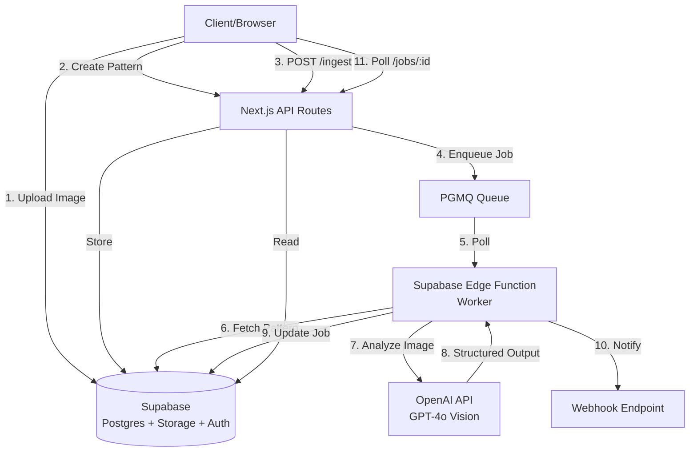
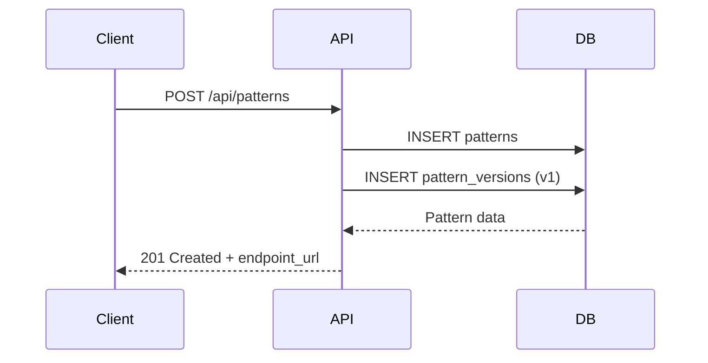
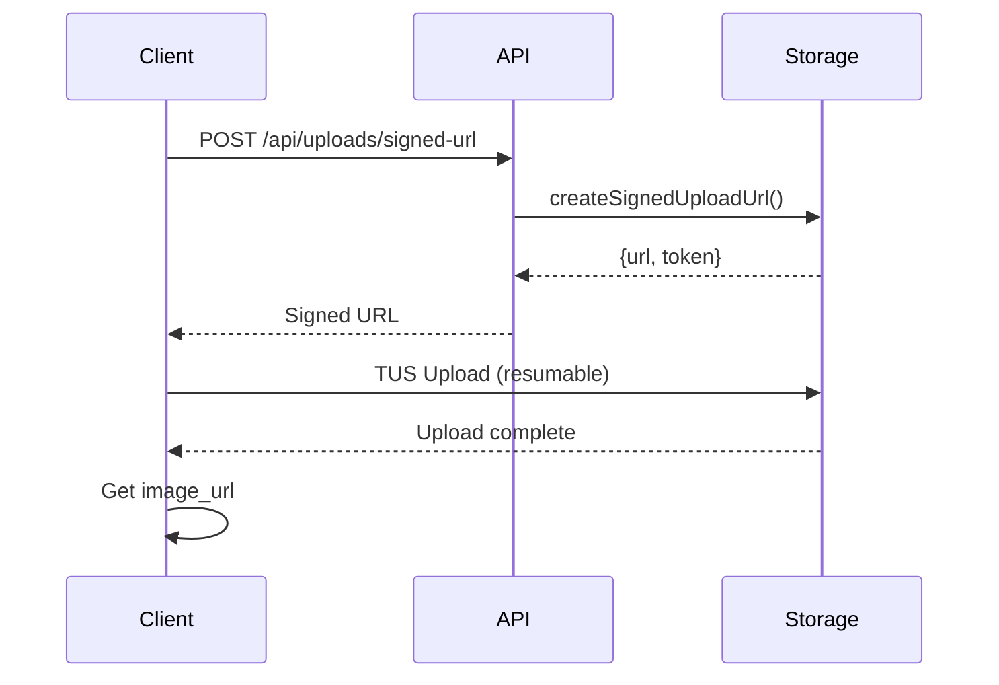
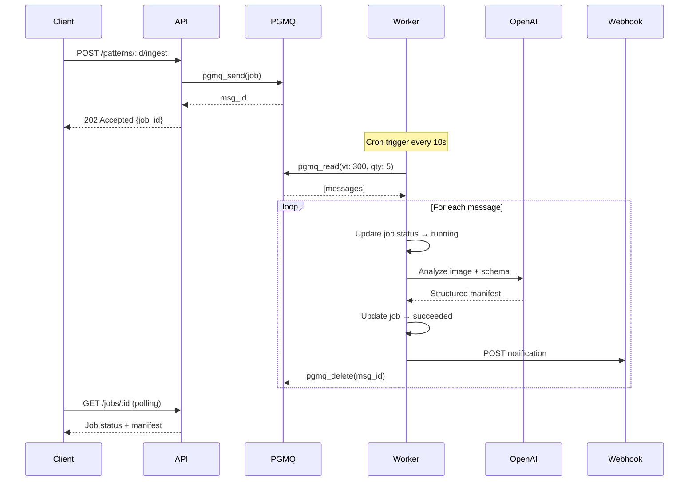

# ImgGo Architecture

## System Overview

ImgGo is a serverless, queue-based image analysis platform built on Next.js, Supabase, and OpenAI.



## Core Components

### 1. Next.js Frontend & API

**Purpose**: User interface and control plane API

**Responsibilities**:

- Pattern CRUD operations
- User authentication (Supabase Auth)
- Signed upload URL generation
- Job enqueueing
- Job status queries

**Stack**:

- Next.js 15 App Router
- React Server Components
- Tailwind CSS + shadcn/ui
- TypeScript with strict mode

**Key Files**:

- `app/api/patterns/` - Pattern management
- `app/api/jobs/` - Job queries
- `app/api/uploads/` - Storage integration
- `app/patterns/new/` - Pattern Studio UI

### 2. Supabase (Database + Storage + Auth)

**Purpose**: Persistence, authentication, and file storage

**Database Schema**:

- `profiles` - User data (synced with auth.users)
- `patterns` - Pattern definitions and schemas
- `pattern_versions` - Version history
- `jobs` - Job queue and results
- `webhooks` - Webhook subscriptions
- `rate_limits` - Token bucket state

**Storage**:

- Private bucket `images`
- TUS resumable upload support
- Signed URLs for secure access

**RLS Policies**:

- All tables protected by Row Level Security
- Users can only access their own data
- Service role bypasses RLS for workers

### 3. PGMQ (PostgreSQL Message Queue)

**Purpose**: Decouple ingest from processing

**Features**:

- Built-in visibility timeout
- Message archiving for failures
- Metrics and monitoring
- Native Postgres (no external deps)

**Flow**:

1. API enqueues job → `pgmq_send()`
2. Worker polls → `pgmq_read(vt, batch_size)`
3. On success → `pgmq_delete(msg_id)`
4. On failure → `pgmq_archive(msg_id)`

### 4. Supabase Edge Function (Worker)

**Purpose**: Process images from queue

**Runtime**: Deno (TypeScript)

**Process**:

```plaintext
1. Poll PGMQ (batch of 5)
2. For each message:
   a. Update job status → "running"
   b. Fetch pattern from DB
   c. Call OpenAI with image + schema
   d. Parse structured output
   e. Update job with manifest
   f. Send webhooks
   g. Delete from queue
3. Return stats
```

**Invocation**: Cron trigger every 10s (configurable)

**Error Handling**:

- Retries with exponential backoff
- Failed jobs archived with error details
- Webhook notifications on failure

### 5. OpenAI Integration

**Purpose**: Vision + structured output for image analysis

**Model**: GPT-4o (2024-08-06) with JSON Schema

**Features**:

- Structured Outputs guarantee schema conformance
- Vision API for image understanding
- Temperature 0.2 for deterministic results

**Request**:

```typescript
openai.chat.completions.create({
  model: "gpt-4o-2024-08-06",
  messages: [
    { role: "system", content: systemPrompt },
    {
      role: "user",
      content: [
        { type: "text", text: instructions },
        { type: "image_url", image_url: { url, detail: "high" } }
      ]
    }
  ],
  response_format: {
    type: "json_schema",
    json_schema: { schema: patternSchema, strict: true }
  }
})
```

**Format Conversion**:

- Always infer as JSON first (guaranteed structure)
- Convert to YAML/XML/CSV/TEXT using formatters

### 6. Webhooks

**Purpose**: Real-time notifications

**Signature**: HMAC SHA-256

**Events**:

- `job.succeeded`
- `job.failed`

**Payload**:

```json
{
  "event": "job.succeeded",
  "job_id": "uuid",
  "pattern_id": "uuid",
  "manifest": { ... },
  "timestamp": "ISO 8601"
}
```

**Headers**:

- `X-ImgGo-Signature: sha256=<hmac>`
- `User-Agent: ImgGo-Webhook/1.0`

## Data Flow

### Pattern Creation



### Image Upload (TUS)



### Job Processing



## Security

### Authentication

- Supabase Auth (JWT)
- RLS policies enforce data isolation
- Service role for worker only

### API Keys (Future)

- Hashed storage
- Scoped permissions
- Rate limiting per key

### Webhooks

- HMAC SHA-256 signatures
- Timing-safe comparison
- 30s timeout

### Storage

- Private bucket by default
- Signed URLs for time-limited access
- User-scoped paths

### Rate Limiting

- Token bucket per user per endpoint
- Postgres-backed state
- Configurable limits

## Observability

### Logging

Structured JSON logs with:

- `timestamp`
- `level` (debug, info, warn, error)
- `message`
- `request_id`
- `user_id`
- `job_id`
- `pattern_id`

### Health Check

`GET /api/_health`

Returns:

```json
{
  "status": "healthy",
  "timestamp": "...",
  "services": {
    "database": "up",
    "storage": "up",
    "queue": "up"
  }
}
```

### Metrics

- Job latency: `jobs.latency_ms`
- Queue depth: `pgmq_metrics()`
- Error rates: `jobs.status = 'failed'`
- Webhook delivery: `webhooks.last_triggered_at`

## Scaling Strategies

### Vertical

- Increase worker batch size
- More frequent Cron triggers
- Larger Supabase instance

### Horizontal

- Multiple worker deployments
- Queue sharding by pattern
- CDN for static assets
- Read replicas for job queries

### Cost Optimization

- Cache Pattern Studio templates
- Batch webhook deliveries
- Archive old jobs to cold storage
- Use cheaper models for simple patterns

## Technology Choices

| Component | Technology | Rationale |
|-----------|-----------|-----------|
| Frontend | Next.js 15 | RSC, App Router, Vercel deploy |
| Database | Supabase Postgres | RLS, PGMQ, Auth built-in |
| Queue | PGMQ | Native Postgres, no external deps |
| Worker | Supabase Edge Functions | Serverless, Deno runtime |
| LLM | OpenAI GPT-4o | Structured Outputs, Vision |
| Validation | Zod | Runtime safety, TypeScript |
| Styling | Tailwind + shadcn | Minimal, professional UI |

## Future Enhancements

1. **Multi-Model Support**
   - Anthropic Claude vision
   - Google Gemini Vision
   - OSS models (Florence-2, YOLOv10)

2. **Advanced Features**
   - Batch processing API
   - Pattern versioning with rollback
   - A/B testing patterns
   - Custom model fine-tuning

3. **Enterprise**
   - Team workspaces
   - RBAC
   - Audit logs
   - SLA guarantees
   - On-premise deployment
