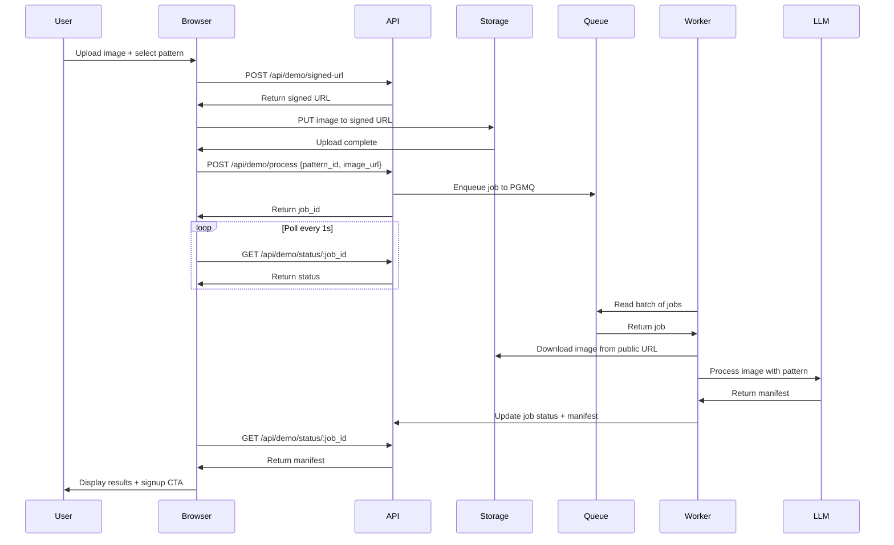

# Landing Page Demo Testing Guide

## Overview

The landing page demo allows unauthenticated users to test ImgGo's capabilities without signing up. It includes a 3-pillar interface:

1. **Left Pillar**: Drag-and-drop image upload
2. **Middle Pillar**: Format selection (5 demo patterns)
3. **Right Pillar**: Results display + signup CTA

## Demo Patterns

5 fixed demo patterns are available, each with identical fields but different output formats:

| ID | Name | Format | Schema Fields |
|----|------|--------|---------------|
| `00000000-0000-0000-0000-000000000001` | JSON Analysis | JSON | Uses `json_schema` with structured output |
| `00000000-0000-0000-0000-000000000002` | CSV Analysis | CSV | Uses `csv_schema` with dynamic schema generation |
| `00000000-0000-0000-0000-000000000003` | XML Analysis | XML | Uses `xml_schema` with schema-guided prompting |
| `00000000-0000-0000-0000-000000000004` | YAML Analysis | YAML | Uses `yaml_schema` with schema-guided prompting |
| `00000000-0000-0000-0000-000000000005` | Text Analysis | Plain Text | Uses `plain_text_schema` with markdown conversion |

### Common Schema Fields

All patterns extract the same information:

- `title`: string - Description of the image
- `colors`: array/string - Dominant colors
- `tags`: array/string - Image tags/keywords
- `is_person`: boolean - Whether image contains people
- `is_animal`: boolean - Whether image contains animals
- `is_landscape`: boolean - Whether image is a landscape

### Format-Specific Handling

**JSON**: Native arrays and booleans
```json
{
  "title": "Mountain Road",
  "colors": ["blue", "green", "gray"],
  "tags": ["landscape", "road", "nature"],
  "is_person": false,
  "is_animal": false,
  "is_landscape": true
}
```

**CSV**: Comma-separated strings
```csv
title,colors,tags,is_person,is_animal,is_landscape
Mountain Road,"blue,green,gray","landscape,road,nature",false,false,true
```

**XML**: Nested elements
```xml
<?xml version="1.0" encoding="UTF-8"?>
<analysis>
  <title>Mountain Road</title>
  <colors>
    <color>blue</color>
    <color>green</color>
  </colors>
  <tags>
    <tag>landscape</tag>
    <tag>road</tag>
  </tags>
  <is_person>false</is_person>
  <is_animal>false</is_animal>
  <is_landscape>true</is_landscape>
</analysis>
```

**YAML**: List with dashes
```yaml
title: Mountain Road
colors:
  - blue
  - green
  - gray
tags:
  - landscape
  - road
  - nature
is_person: false
is_animal: false
is_landscape: true
```

**Text**: Markdown format
```markdown
# Title
Mountain Road

# Dominant Colors
- Blue
- Green
- Gray

# Tags
- Landscape
- Road
- Nature

# Contains Person
No

# Contains Animal
No

# Is Landscape
Yes
```

## API Endpoints

### 1. Get Signed Upload URL
```
POST /api/demo/signed-url
```

**Request**:
```json
{
  "path": "demo/1234567890-image.png"
}
```

**Response**:
```json
{
  "url": "https://...supabase.co/storage/v1/object/upload/sign/images/demo/...",
  "token": "...",
  "path": "demo/1234567890-image.png"
}
```

**Features**:
- No authentication required
- Bypasses rate limiting
- Privileged endpoint for demo users

### 2. Upload Image to Storage
```
PUT {signed_url}
```

**Headers**:
- `Content-Type: image/png` (or appropriate image type)
- `x-upsert: true`

**Body**: Binary image data

### 3. Process Image
```
POST /api/demo/process
```

**Request**:
```json
{
  "pattern_id": "00000000-0000-0000-0000-000000000001",
  "image_url": "https://...supabase.co/storage/v1/object/public/images/demo/..."
}
```

**Response**:
```json
{
  "job_id": "abc-123-def-456",
  "status": "queued",
  "pattern": {
    "id": "00000000-0000-0000-0000-000000000001",
    "name": "Demo: JSON Analysis",
    "format": "json"
  }
}
```

**Features**:
- Validates pattern_id is a demo pattern
- No authentication required
- No rate limiting
- Sets `requested_by: null` for anonymous users

### 4. Check Job Status
```
GET /api/demo/status/:job_id
```

**Response (queued)**:
```json
{
  "job_id": "abc-123-def-456",
  "status": "queued",
  "pattern": {
    "id": "00000000-0000-0000-0000-000000000001",
    "name": "Demo: JSON Analysis",
    "format": "json"
  },
  "created_at": "2025-01-28T12:00:00Z",
  "updated_at": "2025-01-28T12:00:00Z"
}
```

**Response (succeeded)**:
```json
{
  "job_id": "abc-123-def-456",
  "status": "succeeded",
  "pattern": { ... },
  "manifest": { ... },
  "latency_ms": 1234,
  "created_at": "2025-01-28T12:00:00Z",
  "updated_at": "2025-01-28T12:00:01Z"
}
```

**Response (failed)**:
```json
{
  "job_id": "abc-123-def-456",
  "status": "failed",
  "pattern": { ... },
  "error": "Error message",
  "created_at": "2025-01-28T12:00:00Z",
  "updated_at": "2025-01-28T12:00:01Z"
}
```

## Testing

### Prerequisites

1. **Docker Desktop** must be running
2. **Supabase** local instance must be started:
   ```bash
   npm run supabase:start
   ```
3. **Next.js dev server** must be running:
   ```bash
   npm run dev
   ```
4. **Demo patterns** must be created in database (see migration scripts)

### Automated Testing

Run the comprehensive test suite:

```bash
npm run test-demo
```

This will:
1. Test all 5 demo patterns sequentially
2. Upload a test image from `test-photos/landscape-pattern/`
3. Process each pattern
4. Poll for results (max 60 seconds)
5. Verify schema compliance
6. Display results and summary

### Manual Testing

1. **Start services**:
   ```bash
   # Terminal 1: Start Supabase
   npm run supabase:start

   # Terminal 2: Start Next.js
   npm run dev
   ```

2. **Open browser**: Navigate to [http://localhost:3000](http://localhost:3000)

3. **Test demo**:
   - Scroll down to "Try It Now" section
   - Drag and drop an image or click to select
   - Choose a format from dropdown
   - Click "Process Image"
   - Wait for results (up to 60 seconds)
   - Verify output matches expected format

4. **Test error handling**:
   - Try uploading non-image files (should show error)
   - Try uploading files > 10MB (should show error)
   - Try processing without uploading (button should be disabled)

### Troubleshooting

**Docker not running**:
```
Error: open //./pipe/dockerDesktopLinuxEngine: The system cannot find the file specified
```
→ Start Docker Desktop

**Supabase not running**:
```
Error: connect ECONNREFUSED 127.0.0.1:54321
```
→ Run `npm run supabase:start`

**Worker not processing**:
- Check Supabase Edge Function logs: `supabase functions logs worker`
- Verify queue has messages: Check `pgmq.read('ingest_jobs', ...)`
- Check OpenAI API key is set in environment

**Upload fails with 401**:
→ Verify using `/api/demo/signed-url` NOT `/api/uploads/signed-url`

**Worker gets 400 on image download**:
→ Verify using public URL format: `/storage/v1/object/public/{bucket}/{path}`
→ NOT signed upload URL format: `/storage/v1/object/upload/sign/...`

## Architecture



## Security

- **No authentication required**: Demo endpoints are public
- **No rate limiting**: Demo bypasses user rate limits
- **Fixed pattern IDs**: Only pre-defined demo patterns allowed
- **Anonymous jobs**: `requested_by: null` in database
- **Isolated storage**: Demo uploads go to `demo/` prefix
- **Time-based cleanup**: Consider cron job to delete old demo images

## Future Enhancements

- [ ] Add demo usage analytics
- [ ] Implement CAPTCHA to prevent abuse
- [ ] Add demo result caching (same image + pattern)
- [ ] Show processing queue position
- [ ] Add "Share Result" functionality
- [ ] Implement demo rate limiting (per IP)
